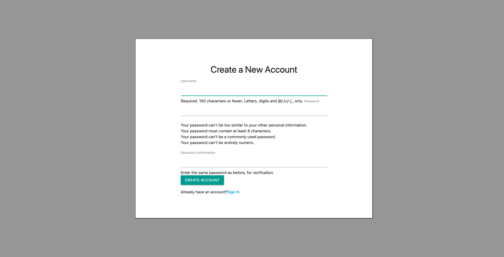
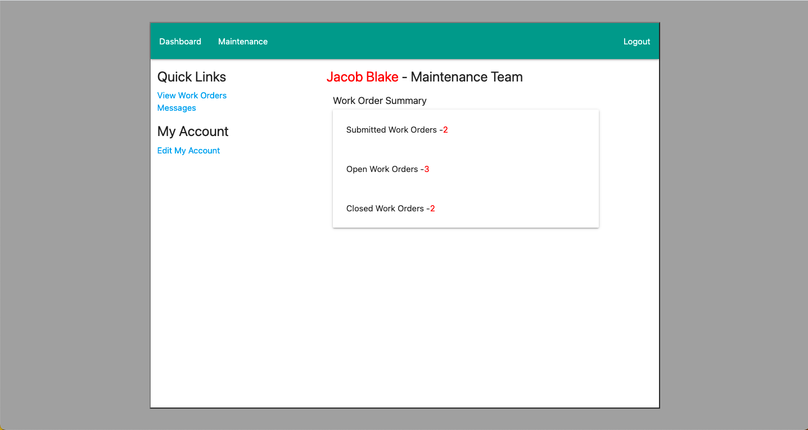
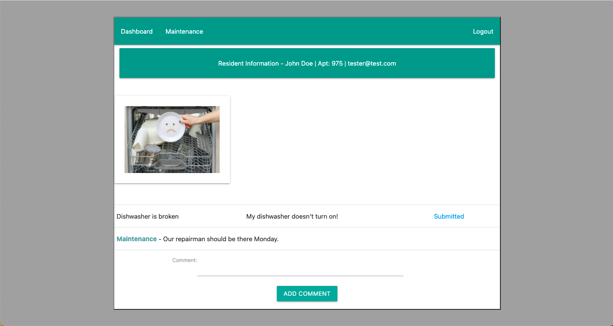
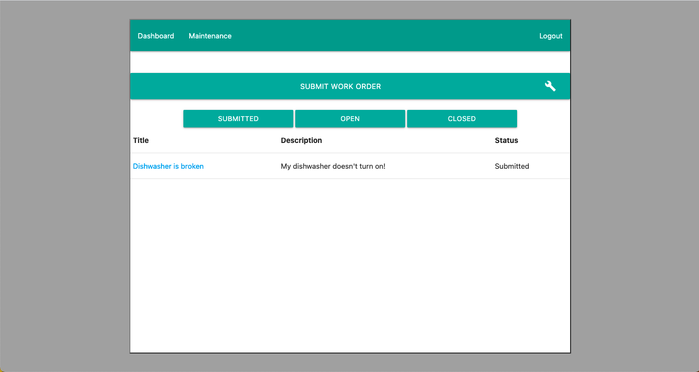

# My Maintenance
My Maintenance is an app to help apartments keep track of repairs needed by residents. Residents can sign up, create a profile, and create work orders. When creating work orders residents can upload pictures to better provide information to the maintenance team. Once a work order is created a member of the maintenance team can accept the work order changing its status from submitted to open. Upon completion of the work order it will then be changed to complete alerting the resident. Maintenance can also comment on work orders to give status updates to the residents.

 

### Login

### Sign Up

### Dashboard

### Work Order

### Technologies Used

- Django/Python
- HTML
- CSS
- Materialize

### Getting Started
To get started simply click the link below and sign up. If you would like a quick way to explore the site there is a tester account for both residents and maintenance, its details are provided on the login page.
- [Deployed App](http://mymaintenance.herokuapp.com/)

### Future Features

This application is still in the early stages of devlopment but I hope to have a more responsive design and added features in the near future. Some features currently in the process of being implemented include:

- Alert residents when a work order has been completed
- Optimize design for mobile.
