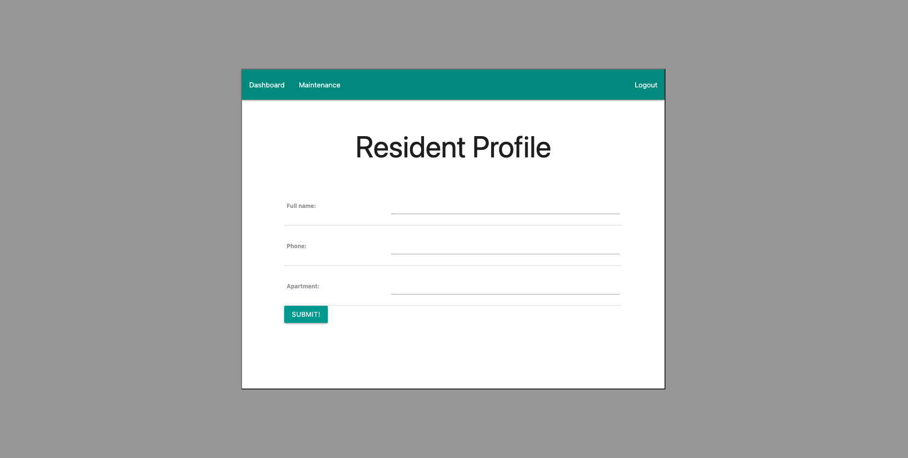
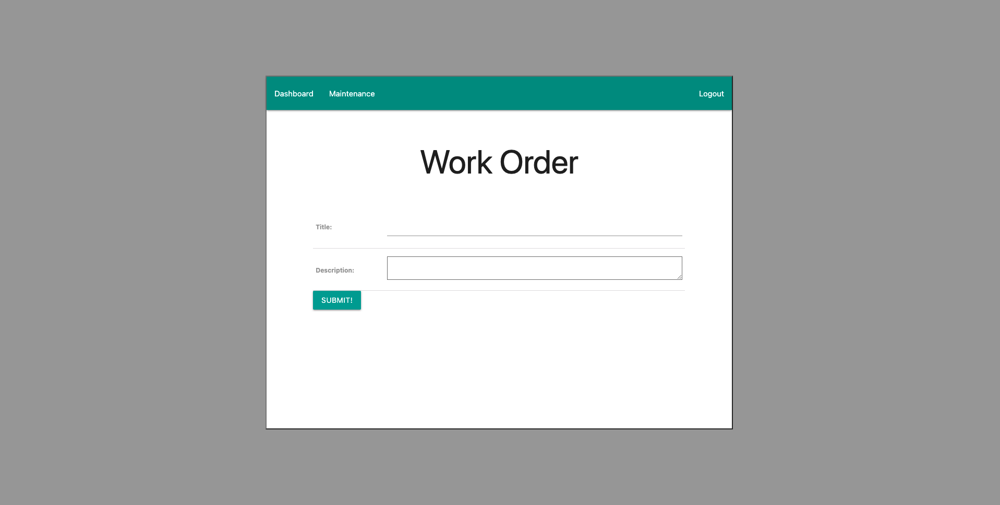
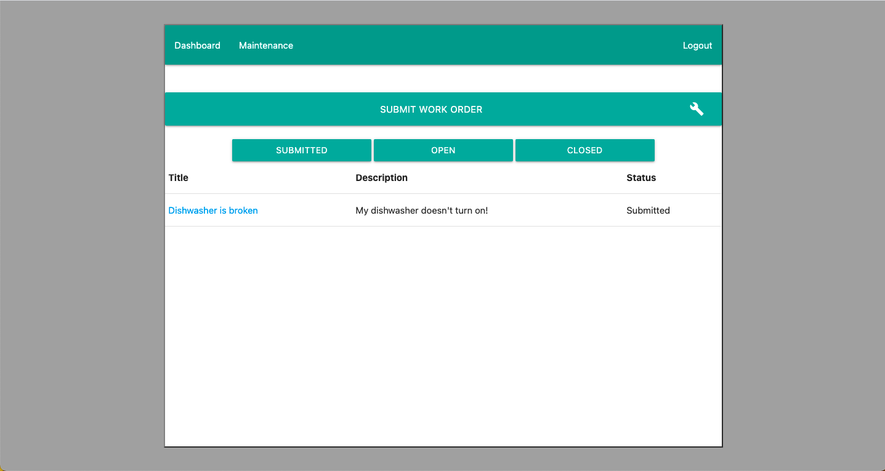

# My Maintenance
My Maintenance is an app I am currently building to help apartments keep track of repairs needed by residents. I hope to provide funcionality to easily allow residents to sign up, create a profile, and create work orders. Once a work order is created an admin or member of the maintenance team can accept the work order changing its status from submitted to open. Upon completion of the work order it will then be changed to complete alerting the resident.

 

### Login

### Sign Up

### Work Order

### Technologies Used

-Django/Python
-HTML
-CSS
-Materialize

### Future Features

This application is still in the early stages of devlopment but I hope to have a more responsive design and added features in the near future. Some features currently in the process of being implemented include:

- Upload images to work orders.
- Allow maintenance members to take on work orders.
- Design enhancements.
